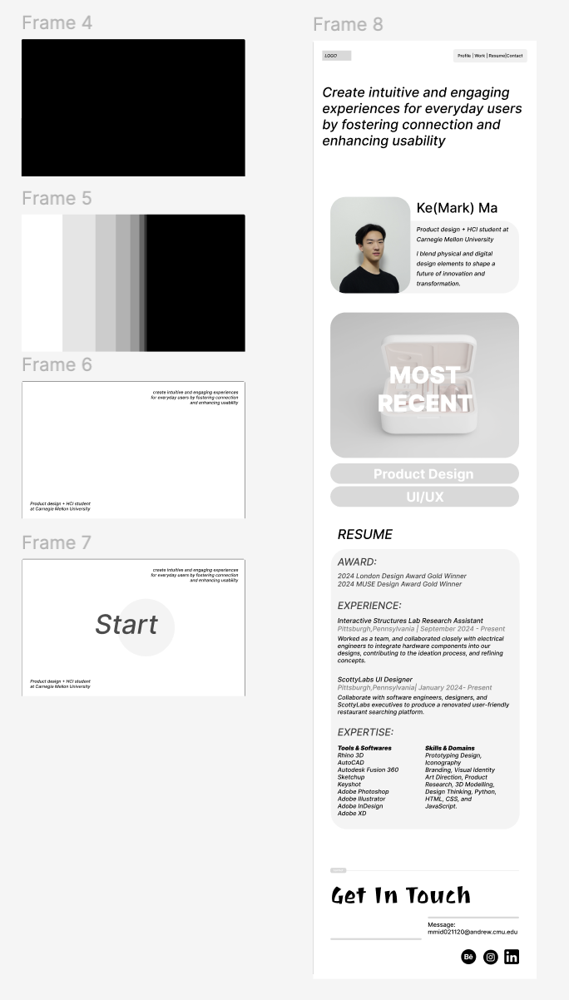

<mark>**Note that this document order from FP4 -> FP1**</mark>

# **FP4 \- Final Project Writeup**

Feel free to refer to this [Markdown Cheat Sheet](https://www.markdownguide.org/cheat-sheet/) to make your writeup more organized, and you can preview your markdown file in VSCode [Markdown editing with Visual Studio Code](https://code.visualstudio.com/docs/languages/markdown#_markdown-preview). 

Please sign up for the study at [https://tinyurl.com/pui-study](https://tinyurl.com/pui-study) to allow us to use your submission to create a better GenAI assistant for designers!

## Part 1: Website Description

Describe your website (300 words).

The purpose of my portfolio website is to showcase my skills, creativity, and professional projects as an industrial designer. By curating and presenting my work in an organized and visually engaging manner, the website acts as a digital resume and an extension of my professional identity. Additionally, it aims to attract potential clients, employers, collaborators, and design enthusiasts while offering an interactive glimpse into my creative process.

The website is designed for a diverse audience, including design professionals, recruiters, clients, and peers in the design industry. It provides detailed information about my design philosophy, portfolio projects, and technical skills. Additionally, contact information and links to my other media are also included for people get to know me better.

The website is crafted to be visually compelling, with a modern and clean design that reflects my style as a designer. Interactive elements, animations, and seamless navigation make the browsing experience engaging and intuitive. High-quality visuals, descriptive narratives, and a responsive design ensure visitors stay captivated while exploring my work.

## Part 2: User Interaction

How a user would interact with your website? For each step, briefly but clearly state the interaction type & how we should reproduce it.

1. Clickable button on index.html, the loading page. This button brings you to the main page
2. A top bar that always stays on top of the page for users to navigate
3. Clickable Logo on the top left corner, this is in every page but not the loading page. To insure user can also navigate back to the top of the main page
4. Clickable Navigation links on the top right, in the main page, helps you navigate inside the main page.
5. Clickable Resume button, on the top right of the main page. It brings you to view my resume.
6. Scrollable main page with unique transitions between each sections. 
7. Hover effect on the vision statement in the main page for interaction
8. Fade in effect and hover effect in the main page for interaction (it also changes text color)
9. Project gallery on the main page allows user to quickly go through my projects.
10. Left and right buttons to controll the gallery
11. Keyboard function, left and right key also also the navigation.
12. Clickable "see more" button on the product gallery that brings you to view the project details
13. Number element on the project page shows you the current image out of the total
14. Preview element on the left (at the bottom for smaller screen) for users to move faster and skip pages
15. Keyboard function, up and down key to scroll though the images .
16. Clickable "instagram","behance", and "linkedin" buttons on the main page brings you to reletive sites.
17. Clickable email on the mainpage brings you to write a email to me. 
18. Clickable phone number on the mainpage brings you to call me. 
19. Back to top button on the main page brings users back to the top, avoiding scrolling

## Part 3: External Tool

Describe what important external tool you used (JavaScript library, Web API, animations, or other). Following the bulleted list format below, reply to each of the prompts.

1. GSAP

   I am amazed by this library. I used it for many design elments. I especially used scroll trigger which allows me to add cool transition animations to my page in between sections. I have also used it to enhance my design elements, for example, the rotating cube. This libaray pushes the overall experience on my portfolio and made it more appealing for users to review. 

2. cdnjs:

   I was exploring different ways to accomplish things. This libaray allows me to use icons in your project without downloading and hosting the files yourself. I used it on my project gallery section for my left and right clickable buttons.

## Part 4: Design Iteration

During the development of my website, I iterated on my prototypes extensively, incorporating feedback from friends after each major update. Their insights helped me identify usability and accessibility issues that I might have overlooked. For example, I initially planned to organize the project gallery into different categories, but I realized that requiring users to click through multiple sections to view my work was cumbersome and inefficient. Additionally, I adjusted the layout and navigation to ensure it was intuitive and user-friendly, improving accessibility for a wider audience. I also re-evaluated color contrasts, text readability, and button placements based on feedback to create a cleaner, more cohesive design. 

## Part 5: Implementation Challenge

One of the biggest challenges I faced while implementing my website was using GSAP (GreenSock Animation Platform), as I had never worked with it before. Learning how to integrate GSAP animations and troubleshoot issues like animations not firing correctly or conflicting with other CSS transitions was difficult. Debugging these problems proved to be challenging, especially when the animations didn’t behave as expected. I had to dive deep into the GSAP documentation and experiment with different approaches to figure out how to best use its features.

## Part 6: Generative AI Use and Reflection

Describe how you used Generative AI tools to create this final project (a page max, \~500 words).

### ChatGPT Usage
For my final project, I used Generative AI tools to enhance various aspects of the development process, and overall, they were incredibly helpful in meeting my expectations and the plans I outlined in [FP2]. In the initial stages, I was able to work efficiently. However, as the project neared completion, I ran out of time and decided to ask the AI to write more advanced pieces of code for me, such as GSAP ScrollTrigger animations, to save time. 

Often times the AI-generated code provided a solid starting point, it did not match my expectations entirely. I had to adjust various aspects of the code, especially when it came to timing and spacing. For example, the animations didn’t always match the smooth transitions I had in mind, and the spacing between elements didn’t align perfectly with my design. I realized that while the AI is great at providing possible solutions, there’s always a need for further refinement. It’s a powerful tool that helped accelerate my workflow, but I couldn’t rely on it entirely without making manual adjustments to fine-tune the result. Despite these challenges, the AI made a huge difference in allowing me to implement advanced features that I wouldn’t have been able to code from scratch in the limited time. Ultimately, the tool helped streamline many parts of the project, but I still had to apply my own design knowledge and critical thinking to ensure everything aligned with my vision.

***Usage Experiences by Project Aspects***

| Ratings | design | plan | write code | debug | \_ (other?) |
| :---- | :---- | :---- | :---- | :---- | :---- |
| Usage1 | No because as as a designer, I dont think it can do beter | no because there is not need | yes because it can be inspiring sometimes | yes because it is very good at it. Much faster then me | no |
| Reduce/Improve Productivity2 | 1| 1 | 5, because it knows codes like the libaraies better. |7, it works a lot faster | no|

[1] I used / did not use this tool for X aspect of the project because …  
[2] This tool makes my productivity for X aspect (1-Much Reduced, 2-Reduced, 3-Slightly Reduced, 4-Not Reduced nor Improved, 5-Slightly Improved, 6-Improved, 7-Much Improved)

***Prompts and Chat History Links***

I did not save or document every individual task or prompt used during the development process. However, I did regularly use ChatGPT to assist with debugging and to generate complex code when I encountered challenges that I couldn’t solve on my own. For example, I used ChatGPT to help me implement the GSAP library and its ScrollTrigger feature, as I was unfamiliar with its syntax and integration. When I hit roadblocks or needed a more efficient way to approach a problem, I turned to the AI for guidance. The tool was invaluable in providing solutions, but I only relied on it when necessary, ensuring that I still understood the logic and made adjustments where needed to fit my design and functionality requirements.

***Wave Screenshots***

I attempted to fix the contrast issue and ensured that it was visually corrected. However, I believe the testing tool is unable to properly recognize the images, which is likely why it is flagging multiple errors.

---

<!-- # **FP3 \- Final Project Check-in**

Document the changes and progress of your project. How have you followed or changed your implementation & GenAI use plan and why? Remember to commit your code to save your progress.

## Implementation Plan Updates

- [ ] ...

## Generative AI Use Plan Updates

- [ ] ...

Remember to keep track of your prompts and usage for [FP4 writeup](#part-6-generative-ai-use-and-reflection).

--- -->

# **FP2 \- Evaluation of the Final project**

## Project Description

Briefly restate your motivation and a short description of your project.

## High-Fi Prototypes

### *Prototype 1*
This is a design for my portfolio. It mainly highlights the projects I have done. The design is aiming for a simplistic approach so the user would not get lost in navigation. There are four main sections: profile, work, resume, and contact. 

The first design uses a numerical loading screen and the second design uses a visual, color change, loading screen. The layout of the main page is also slightly different. Although the designs currently look a bit simple, there will be animations that separate each section and interactive elements when the viewer interacts with the page. 

## Usability Test

I scheduled meetings with the participants who were interested in my portfolio. I would ask each participant what they typically want to see in a portfolio. Then, I would start the prototype for them and observe how they could interact with it. Ultimately, I would ask them about their feedback and possible iterations. The feedback they gave was very constructive. Firstly, it was suggested that the resume should be on a separate page because it is usually seen as a separate document. Secondly, they found the Figma demo hard to follow since the sections are not separated. However, this should not be the problem if interactive animations are applied. Thirdly, for the overall layout, they suggested I should use the same font so it is not too overwhelming and shows a uniform design. Fourthly, there should be more visual hints on the main page because they might not know what to do at first. Filthy, for the work section make sure all three sections are in the same hierarchy so they do not look like subcategories. 

## Updated Designs

Here is the updated version of my designs. For those designs, the work section was redesigned, the slide bar was included, font sizes were changed, and the resume was moved to another page. 

## Feedback Summary

During the lab, I did not receive much feedback. It was mentioned that the size text is a bit too big and it bit too much. I will consider that feedback in refining my designs. 

## Milestones

Before going straight into codes, I wish to explore the libraries more. I did some research beforehand but there is more to learn. From now until November 15th, I will do more research on the libraries and get started on my HTML. From November 15th to 22nd, I will finish up HTML and CSS, and from November 22nd to December 6th, I will finish Javascript and implement those libraries. Since I am working on a personal portfolio, I am considering mainly using GSAP and ScrollReveal; those libraries would be available to perform most of my functionalities. I also use Anime.js, Three.js, and Pixijs for any missing functionalities. 

### *Implementation Plan*

Before going straight into codes, I wish to explore the libraries more. I did some research beforehand but there is more to learn. From now until November 15th, I will do more research on the libraries and get started on my HTML. From November 15th to 22nd, I will finish up HTML and CSS, and from November 22nd to December 6th, I will finish Javascript and implement those libraries. 

### *Libraries and Other Components*

Since I am working on a personal portfolio, I am considering mainly using GSAP and ScrollReveal; those libraries would be available to perform most of my functionalities. I also use Anime.js, Three.js, and Pixijs for any missing functionalities. 

## Generative AI Use Plan

Generative AI can definitely be helpful when it comes to this project. To start the project, I may use it to search for possible libraries and ways to add them to my code. When I am facing problems adding one, I can use generative AI as a private tutor to teach me step by step. I may also use it to help me debug or give me constructive feedback. However, Generative AI would not be able to help me understand the contents. Since adding libraries is a new concept, I should go over the codes generated and understand them line by line. To use it responsibly, I should always disclose when using AI to generate content or solutions, ensuring others understand the source of information and validate the information provided by AI.

# **FP1 \- Proposal for Critique**

## Idea Sketches

### *Idea 1*

This is my first proposal for the portfolio design. It is mainly focused on page transitions and page linking. You will start the portfolio with a loading screen which includes the loading percentage and a brief description of myself. Then it will bring you to the main page which includes a header that stays on the top of the page. In the header you may see that description again and a selection of categories (about, work, resume, and contact). If you click on any of the categories, you will be taken to the related page. If you scroll down on the main page, you can see the vision statement, the About section that introduces my background as a designer, and ways to contact me. When you click on the work section, it will bring you to see the subcategories, current work, and previous work. If clicked, it will bring you to the linked gallery page. The main interaction that takes place in this design is the transition between pages and how one-page links to another. 

### *Idea 2*

This is my second proposal for the portfolio design. Unlike the first one, this one was simplified into one main page so that users do not have to go through a complex process of navigation. This might be seen as an interactive resume. The site will first start with a loading screen that shows the loading percentage, a description of myself, and my vision statement. Once it is fully loaded, the loading number will turn into a “Start” button that can be clicked to bring it to the main page. On the main page, there will be a header on the top that includes, About, Work, and Contact. On the page, it shows the category information accordingly. For the work section, it will showcase a selection of my highlighted works and subcategories of UI/UX and industrial design. 

### *Idea 3*

This is my third design, which takes a more creative and innovative approach to user navigation. The main concept revolves around a scrolling ball that users can control seamlessly using either a trackpad or keyboard shortcuts. This unique feature allows for an engaging and intuitive browsing experience, as users can easily scroll forward and backward through different sections of the site.

The journey begins with the About section, providing a personal introduction that sets the stage for what follows. This is followed by my vision statement, which outlines my goals and aspirations in a compelling manner. The design then transitions to showcase my work, displayed individually and in chronological order. This chronological presentation not only highlights my growth and development over time but also tells a story about my evolving skills and experiences. Finally, users will find my contact information, easily accessible to facilitate communication. This structured yet dynamic flow encourages users to immerse themselves in my narrative while navigating through the content.

## Feedback Summary

From the critique, I have learned the importance of including keyboard shortcuts in my designs. While many users today prefer using a trackpad or a mouse to navigate through websites, it's essential to recognize that the keyboard serves as a vital alternative. This is especially true for elderly users or those with disabilities, for whom keyboard shortcuts can significantly enhance accessibility and overall user experience.

Moreover, I received valuable feedback on my first and second designs, which, while effective, resembled resumes more than engaging web interfaces. To make my designs more captivating, I should consider incorporating a wider array of interactive elements. Interactions don't need to be limited to basic effects, such as pop-outs or color changes upon hovering; there's an opportunity to think creatively about user engagement. For instance, I could explore audio interactions that add another layer of depth, or even consider animating the entire screen in a way that captures users’ attention and makes the experience more immersive. By expanding my approach to interaction design, I can create a more dynamic and inclusive environment that caters to a broader audience.

## Feedback Digestion

After the critique session, I feel much more confident in pursuing my second design idea, as it garnered the most positive feedback from my peers. This response has reinforced my belief that it has the potential to resonate well with users. I plan to incorporate keyboard shortcuts thoughtfully, aligning them with specific functions to enhance usability. For instance, the up and down arrow keys can serve as direct replacements for scrolling with the trackpad, making navigation smoother and more intuitive. Additionally, I can implement number keys to allow users to jump to corresponding sections or pages, further streamlining the browsing experience.

To enrich the design, I will also focus on adding more interactive elements. Color will play a significant role in this approach. For example, if the portfolio's color theme is centered around vibrant orange, I envision an interaction where hovering over a text element triggers an orange background to appear, creating a visually cohesive effect. When a user clicks on that text, the page will transition to a full orange screen before revealing the content, adding a layer of excitement to the navigation.

Furthermore, to make specific sections more engaging, I plan to incorporate animations that relate directly to the content. For instance, when discussing my ski helmet design, I could showcase an animation of a skier gracefully navigating down a slope, visually representing the product in action. Similarly, when I delve into my musical projects, I could include background music that complements the discussion, enriching the overall experience and drawing users deeper into my creative world. These enhancements will not only make my portfolio more dynamic but also create a memorable interaction that highlights my unique style and skills.